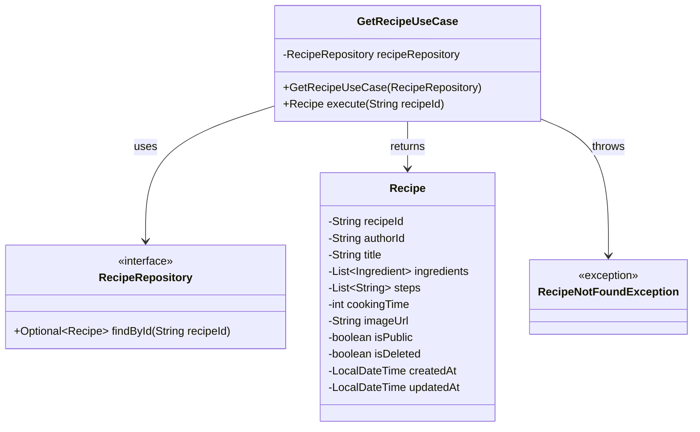
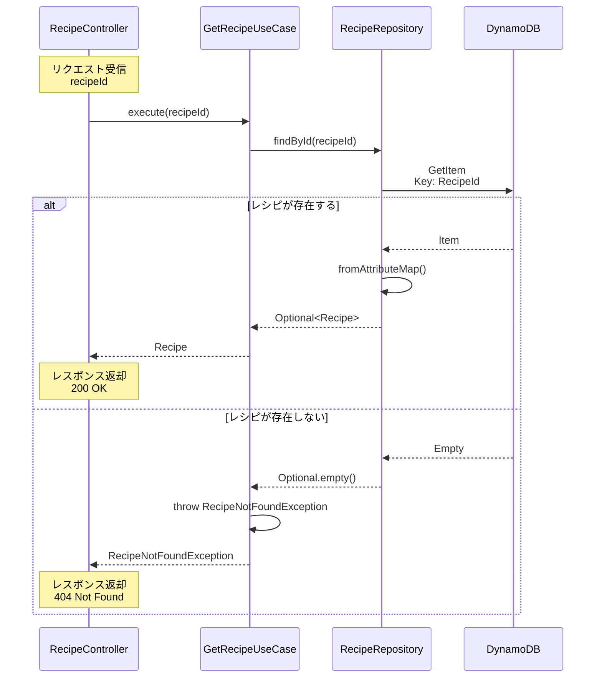

# レシピ詳細取得ユースケース 設計書

## 概要

**クラス名**: `GetRecipeUseCase`

**パッケージ**: `com.cookingapp.application.usecase.recipe`

**責務**: レシピIDを指定してレシピ詳細情報を取得する

**エンドポイント**: `GET /api/recipes/{id}`

## クラス図



## シーケンス図



## メソッド仕様

### execute(String recipeId)

**目的**: レシピIDを指定してレシピ詳細を取得する

**引数**:

| 引数名 | 型 | 必須 | 説明 | 例 |
|--------|---|------|------|-----|
| recipeId | String | ✓ | レシピID（UUID） | "660e8400-e29b-41d4-a716-446655440001" |

**戻り値**:

| 型 | 説明 |
|----|------|
| Recipe | レシピエンティティ |

**例外**:

| 例外 | 発生条件 |
|------|---------|
| RecipeNotFoundException | レシピが存在しない場合 |

**処理フロー**:

1. `recipeRepository.findById(recipeId)` でレシピを検索
2. レシピが存在する場合、`Recipe` エンティティを返却
3. レシピが存在しない場合、`RecipeNotFoundException` をスロー

## ビジネスルール

### BR1: レシピ取得条件
- レシピIDが存在すれば取得可能
- 削除済みレシピ（`isDeleted = true`）も取得される
- 非公開レシピ（`isPublic = false`）も取得される

**理由**: 
- Controller層で権限チェックを行うため
- 削除済みレシピの情報も必要な場合がある（参照整合性のため）

### BR2: エラーハンドリング
- レシピが存在しない場合は `RecipeNotFoundException` をスロー
- 例外メッセージには検索したレシピIDを含める

## 依存関係

### 注入される依存

| 依存 | 型 | 説明 |
|------|---|------|
| recipeRepository | RecipeRepository | レシピリポジトリ（インターフェース） |

### 使用するエンティティ

| エンティティ | 説明 |
|------------|------|
| Recipe | レシピドメインエンティティ |

### スローする例外

| 例外 | パッケージ |
|------|-----------|
| RecipeNotFoundException | com.cookingapp.domain.exception |

## 実装例

```java
@Service
public class GetRecipeUseCase {

    private final RecipeRepository recipeRepository;

    public GetRecipeUseCase(RecipeRepository recipeRepository) {
        this.recipeRepository = recipeRepository;
    }

    /**
     * レシピを取得
     * 
     * @param recipeId レシピID
     * @return レシピ
     * @throws RecipeNotFoundException レシピが見つからない場合
     */
    public Recipe execute(String recipeId) {
        return recipeRepository.findById(recipeId)
                .orElseThrow(() -> new RecipeNotFoundException("Recipe not found: " + recipeId));
    }
}
```

## テストケース

### 正常系

| No | テストケース | 入力 | 期待結果 |
|----|------------|------|---------|
| 1 | 存在するレシピIDを指定 | recipeId="660e8400-..." | Recipeエンティティが返却される |
| 2 | 削除済みレシピIDを指定 | recipeId="deleted-recipe-id" | Recipeエンティティが返却される（isDeleted=true） |
| 3 | 非公開レシピIDを指定 | recipeId="private-recipe-id" | Recipeエンティティが返却される（isPublic=false） |

### 異常系

| No | テストケース | 入力 | 期待結果 |
|----|------------|------|---------|
| 1 | 存在しないレシピIDを指定 | recipeId="non-existent-id" | RecipeNotFoundExceptionがスローされる |
| 2 | nullを指定 | recipeId=null | RecipeNotFoundExceptionがスローされる |
| 3 | 空文字を指定 | recipeId="" | RecipeNotFoundExceptionがスローされる |

## 呼び出し元

### RecipeController

```java
@GetMapping("/{id}")
public ResponseEntity<RecipeResponse> getRecipe(@PathVariable("id") String id) {
    Recipe recipe = getRecipeUseCase.execute(id);
    return ResponseEntity.ok(RecipeResponse.from(recipe));
}
```

**責務分担**:
- **Controller**: HTTPリクエスト処理、DTO変換、例外ハンドリング
- **UseCase**: ビジネスロジック（レシピ取得）
- **Repository**: データアクセス

## パフォーマンス

### DynamoDBアクセス

**操作**: `GetItem`

**特徴**:
- Partition Keyによる直接アクセス
- 最も効率的なアクセスパターン
- レイテンシ: 通常 1-10ms

**コスト**:
- 読み取りキャパシティユニット: 1 RCU（4KB以下のアイテム）

## 注意事項

### 1. 論理削除されたレシピの扱い

このユースケースでは削除済みレシピも取得します。削除チェックは呼び出し元で行う必要があります。

**理由**:
- スケジュールや買い物リストからの参照を保持するため
- 削除済みレシピの情報も必要な場合がある

### 2. 権限チェック

このユースケースでは権限チェックを行いません。必要に応じて呼び出し元で実装してください。

**例**:
- 非公開レシピは作成者のみ閲覧可能
- 削除済みレシピは作成者のみ閲覧可能

### 3. エラーメッセージ

例外メッセージにはレシピIDを含めますが、本番環境ではセキュリティ上の理由で詳細情報を隠すことを検討してください。

## 関連ドキュメント

- [レシピ検索機能 シーケンス図](./SEQUENCE_DIAGRAM_RECIPE_SEARCH.md)
- [データベース設計書](../DATABASE_DESIGN.md)
- [API仕様書](../openapi.yaml)
