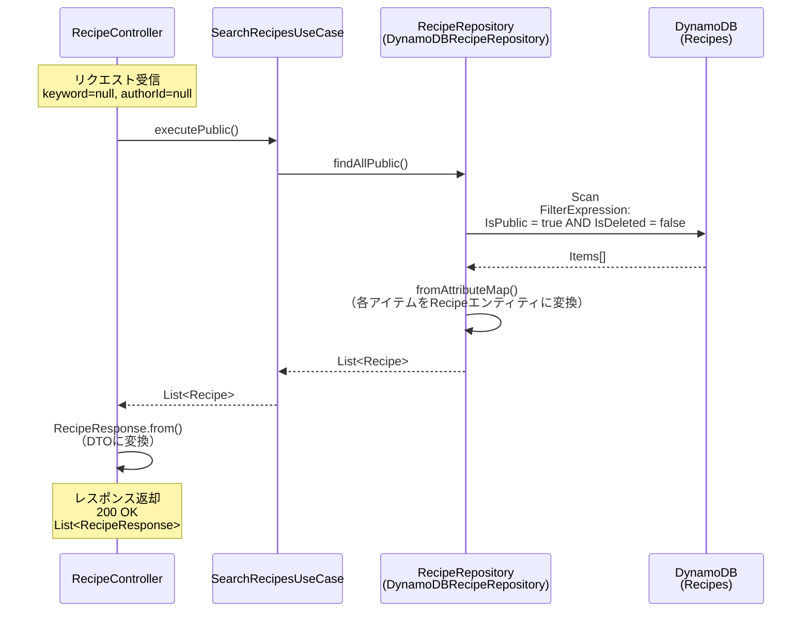
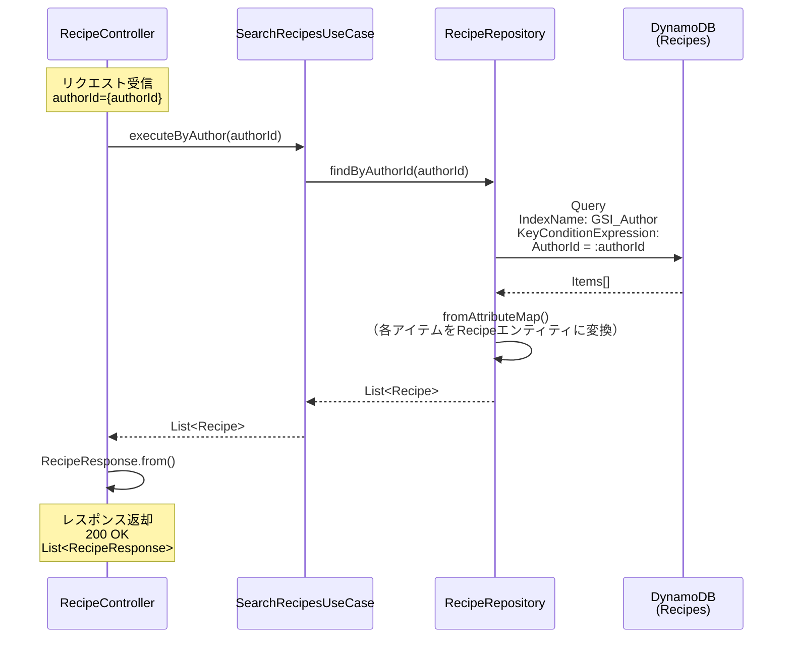
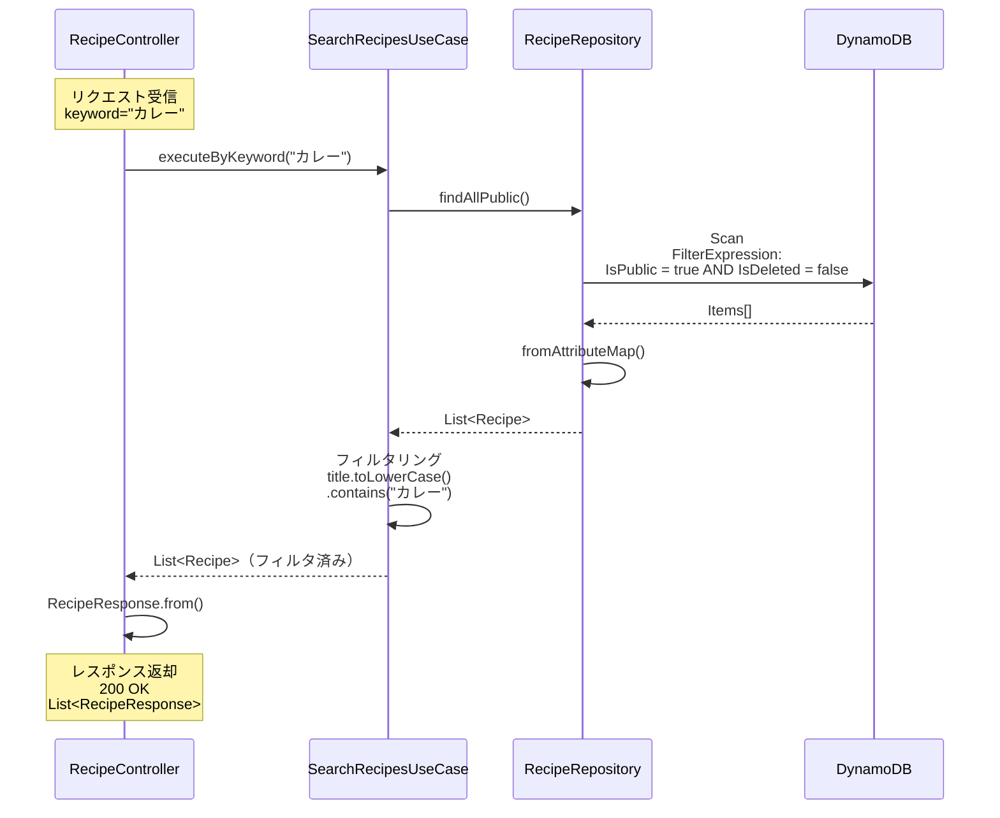
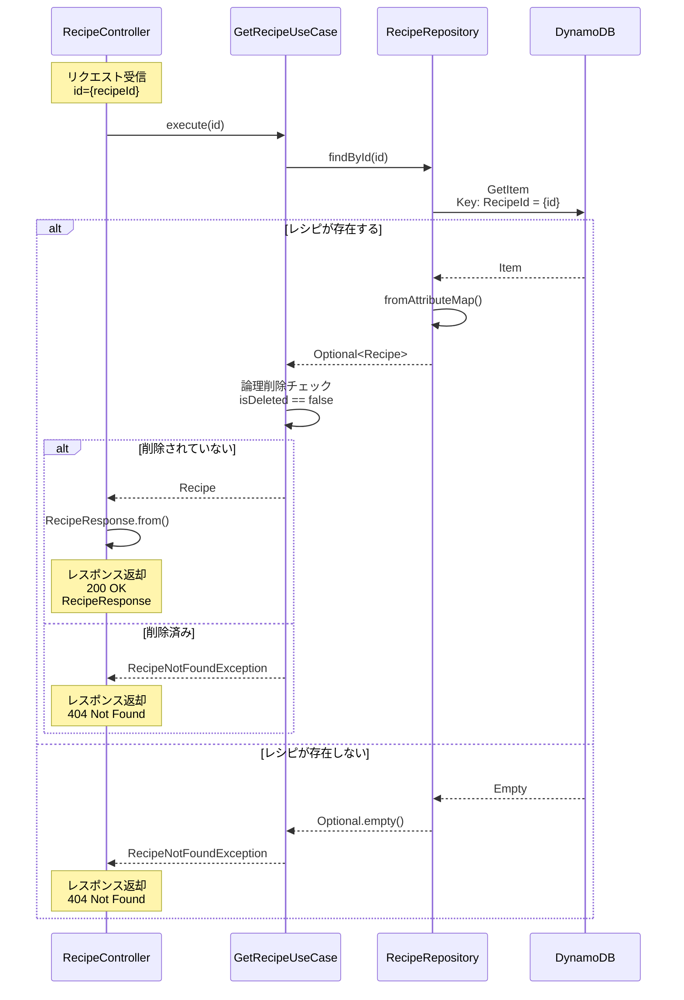

# レシピ検索機能 シーケンス図（バックエンド）

## 1. 公開レシピ一覧取得

**エンドポイント**: `GET /api/recipes`



### リクエスト

| 項目 | 型  | 必須 | 説明           | 例  |
| ---- | --- | ---- | -------------- | --- |
| -    | -   | -    | パラメータなし | -   |

### レスポンス

**ステータスコード**: `200 OK`

**ボディ**: `List<RecipeResponse>`

| 項目        | 型                    | 説明                | 例                                     |
| ----------- | --------------------- | ------------------- | -------------------------------------- |
| recipeId    | String                | レシピID（UUID）    | "660e8400-e29b-41d4-a716-446655440001" |
| title       | String                | レシピタイトル      | "簡単カレーライス"                     |
| authorId    | String                | 作成者ID            | "550e8400-e29b-41d4-a716-446655440000" |
| ingredients | List\<IngredientDto\> | 食材リスト          | 下記参照                               |
| steps       | List\<String\>        | 調理手順            | ["野菜を切る", "炒める", ...]          |
| cookingTime | Integer               | 調理時間（分）      | 30                                     |
| imageUrl    | String                | レシピ画像URL       | "https://s3.../recipe.jpg"             |
| isPublic    | Boolean               | 公開フラグ          | true                                   |
| createdAt   | String                | 作成日時（ISO8601） | "2024-11-15T14:30:00"                  |
| updatedAt   | String                | 更新日時（ISO8601） | "2024-11-20T16:45:00"                  |

**IngredientDto の構造**:

| 項目     | 型         | 必須 | 説明             | 例         |
| -------- | ---------- | ---- | ---------------- | ---------- |
| name     | String     | ✓    | 食材名           | "玉ねぎ"   |
| quantity | BigDecimal |      | 数量（任意）     | 2          |
| unit     | String     |      | 単位（自由入力） | "個"       |
| note     | String     |      | メモ（任意）     | "中サイズ" |
| optional | Boolean    | ✓    | 任意フラグ       | false      |

## 2. 作成者別レシピ検索

**エンドポイント**: `GET /api/recipes?authorId={authorId}`



### リクエスト

**クエリパラメータ**:

| 項目     | 型     | 必須 | 説明             | 例                                     |
| -------- | ------ | ---- | ---------------- | -------------------------------------- |
| authorId | String | ✓    | 作成者ID（UUID） | "550e8400-e29b-41d4-a716-446655440000" |

### レスポンス

**ステータスコード**: `200 OK`

**ボディ**: `List<RecipeResponse>`（構造は「1. 公開レシピ一覧取得」と同じ）

## 3. キーワード検索

**エンドポイント**: `GET /api/recipes?keyword=カレー`



### リクエスト

**クエリパラメータ**:

| 項目    | 型     | 必須 | 説明                                       | 例       |
| ------- | ------ | ---- | ------------------------------------------ | -------- |
| keyword | String | ✓    | 検索キーワード（タイトルに含まれる文字列） | "カレー" |

### レスポンス

**ステータスコード**: `200 OK`

**ボディ**: `List<RecipeResponse>`（構造は「1. 公開レシピ一覧取得」と同じ）

**備考**: キーワードは大文字小文字を区別せず、タイトルに部分一致するレシピを返却

## 4. レシピ詳細取得

**エンドポイント**: `GET /api/recipes/{id}`



### リクエスト

**パスパラメータ**:

| 項目 | 型     | 必須 | 説明             | 例                                     |
| ---- | ------ | ---- | ---------------- | -------------------------------------- |
| id   | String | ✓    | レシピID（UUID） | "660e8400-e29b-41d4-a716-446655440001" |

### レスポンス（成功時）

**ステータスコード**: `200 OK`

**ボディ**: `RecipeResponse`（構造は「1. 公開レシピ一覧取得」と同じ）

### レスポンス（エラー時）

**ステータスコード**: `404 Not Found`

**ボディ**:

```json
{
  "timestamp": "2024-12-10T10:30:00Z",
  "status": 404,
  "error": "Not Found",
  "message": "Recipe not found: 660e8400-e29b-41d4-a716-446655440001",
  "path": "/api/recipes/660e8400-e29b-41d4-a716-446655440001"
}
```

## アーキテクチャ概要

### レイヤー構成（Clean Architecture）

```
┌─────────────────────────────────────────┐
│  Presentation Layer                     │
│  - RecipeController                     │
│  - RecipeRequest/Response (DTO)         │
└─────────────────────────────────────────┘
              ↓
┌─────────────────────────────────────────┐
│  Application Layer                      │
│  - SearchRecipesUseCase                 │
│  - GetRecipeUseCase                     │
└─────────────────────────────────────────┘
              ↓
┌─────────────────────────────────────────┐
│  Domain Layer                           │
│  - Recipe (Entity)                      │
│  - Ingredient (ValueObject)             │
│  - RecipeRepository (Interface)         │
└─────────────────────────────────────────┘
              ↓
┌─────────────────────────────────────────┐
│  Infrastructure Layer                   │
│  - DynamoDBRecipeRepository             │
│  - DynamoDbClient                       │
└─────────────────────────────────────────┘
              ↓
┌─────────────────────────────────────────┐
│  AWS DynamoDB                           │
│  - Recipes テーブル                      │
└─────────────────────────────────────────┘
```

### 主要クラスの責務

| クラス                       | 責務                                         |
| ---------------------------- | -------------------------------------------- |
| **StreamLambdaHandler**      | Lambda エントリーポイント、Spring Boot統合   |
| **RecipeController**         | HTTPリクエスト処理、バリデーション、DTO変換  |
| **SearchRecipesUseCase**     | レシピ検索のビジネスロジック                 |
| **GetRecipeUseCase**         | レシピ詳細取得のビジネスロジック             |
| **RecipeRepository**         | データアクセスインターフェース（ドメイン層） |
| **DynamoDBRecipeRepository** | DynamoDB実装、AttributeMap変換               |

### 共通インフラ層（シーケンス図では省略）

以下は全API共通の処理のため、シーケンス図には記載していません。

**リクエストフロー**:
```
クライアント
  ↓
API Gateway（Cognito認証、ルーティング）
  ↓
Lambda（StreamLambdaHandler）
  ↓
Spring Boot（RecipeController）
```

**API Gateway**:
- Cognito Authorizer による認証
- リクエストルーティング
- レート制限

**StreamLambdaHandler**:
- Spring Boot アプリケーションの起動
- AWS Lambda と Spring Boot の統合
- CORS ヘッダーの自動付与
  - `Access-Control-Allow-Origin: *`
  - `Access-Control-Allow-Methods: GET,POST,PUT,DELETE,OPTIONS,PATCH`
  - `Access-Control-Allow-Headers: Content-Type,Authorization,Accept,Accept-Language,X-User-Id`

**認証情報の伝達**:
- API Gateway が Cognito トークンを検証
- `X-User-Id` ヘッダーでユーザーIDをバックエンドに伝達
- Controller で `@RequestHeader("X-User-Id")` として取得

## DynamoDB アクセスパターン

### 1. 公開レシピ一覧（Scan）

```
Operation: Scan
Table: Recipes
FilterExpression: IsPublic = true AND IsDeleted = false
```

**特徴**:
- 全テーブルスキャン（データ量が多い場合は非効率）
- 将来的にはGSIの追加を検討

### 2. 作成者別検索（Query + GSI）

```
Operation: Query
Table: Recipes
IndexName: GSI_Author
KeyConditionExpression: AuthorId = :authorId
```

**特徴**:
- GSI（Global Secondary Index）を使用
- 効率的な検索が可能

### 3. キーワード検索（Scan + アプリケーション層フィルタ）

```
1. Scan（公開レシピ取得）
2. アプリケーション層でタイトルフィルタリング
```

**特徴**:
- DynamoDBは全文検索に非対応
- 現在はメモリ上でフィルタリング
- 将来的にはElasticsearchやOpenSearch導入を検討

### 4. レシピ詳細取得（GetItem）

```
Operation: GetItem
Table: Recipes
Key: RecipeId = {id}
```

**特徴**:
- 最も効率的なアクセスパターン
- Partition Keyによる直接アクセス

## データ変換フロー

### DynamoDB → Domain Entity

```
DynamoDB AttributeMap
  ↓ fromAttributeMap()
Recipe Entity (Domain)
  ↓ RecipeResponse.from()
RecipeResponse DTO (Presentation)
```

### 変換処理の詳細

**Ingredients（食材）の変換**:
```java
// DynamoDB → Ingredient
Map<String, AttributeValue> → Ingredient
  - name: String
  - quantity: BigDecimal (optional)
  - unit: String (optional, 自由入力)
  - note: String (optional)
  - optional: boolean
```

**Steps（手順）の変換**:
```java
// DynamoDB → Steps
List<AttributeValue> → List<String>
```

## パフォーマンス考慮事項

### 現在の実装

| 操作           | 方式            | パフォーマンス   |
| -------------- | --------------- | ---------------- |
| 公開レシピ一覧 | Scan            | ⚠️ データ量に比例 |
| 作成者別検索   | Query (GSI)     | ✅ 高速           |
| キーワード検索 | Scan + フィルタ | ⚠️ データ量に比例 |
| レシピ詳細     | GetItem         | ✅ 高速           |

### 改善案

1. **公開レシピ一覧**: GSI_IsPublic の追加
2. **キーワード検索**: Amazon OpenSearch Service の導入
3. **キャッシュ**: CloudFront または ElastiCache の導入

## エラーハンドリング

### 主なエラーケース

| エラー                  | HTTPステータス | 説明                               |
| ----------------------- | -------------- | ---------------------------------- |
| RecipeNotFoundException | 404            | レシピが存在しない、または削除済み |
| ValidationException     | 400            | リクエストパラメータ不正           |
| DynamoDbException       | 500            | DynamoDB接続エラー                 |
| UnauthorizedException   | 401            | 認証トークン無効                   |

## ログ出力

### 主要ログポイント

```java
// リポジトリ層
logger.info("Saved recipe: {}", recipe.getRecipeId());
logger.info("Deleted recipe: {}", recipeId);

// Lambda Handler
System.out.println("=== リクエスト処理開始 ===");
System.out.println("=== リクエスト処理完了 ===");
```

**注意**: コーディング規約により `System.out.println()` は禁止。`Logger` を使用すること。
