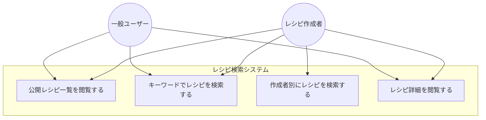

# レシピ検索機能 ユースケース図

## ユースケース図

## ユースケース一覧

| ID | ユースケース名 | アクター | 説明 |
|----|--------------|---------|------|
| UC1 | 公開レシピ一覧を閲覧する | 一般ユーザー、レシピ作成者 | すべての公開レシピを一覧表示する |
| UC2 | キーワードでレシピを検索する | 一般ユーザー、レシピ作成者 | タイトルにキーワードを含むレシピを検索する |
| UC3 | 作成者別にレシピを検索する | レシピ作成者 | 特定の作成者が投稿したレシピを検索する |
| UC4 | レシピ詳細を閲覧する | 一般ユーザー、レシピ作成者 | レシピの詳細情報（食材、手順、画像等）を閲覧する |

## ユースケース詳細

### UC1: 公開レシピ一覧を閲覧する

**概要**: すべての公開レシピを一覧表示する

**アクター**: 一般ユーザー、レシピ作成者

**事前条件**: なし

**基本フロー**:
1. ユーザーがレシピ一覧画面にアクセスする
2. システムは公開中のレシピをすべて取得する
3. システムはレシピ一覧を表示する

**事後条件**: レシピ一覧が表示される

**代替フロー**: なし

---

### UC2: キーワードでレシピを検索する

**概要**: タイトルにキーワードを含むレシピを検索する

**アクター**: 一般ユーザー、レシピ作成者

**事前条件**: なし

**基本フロー**:
1. ユーザーが検索キーワードを入力する
2. ユーザーが検索ボタンをクリックする
3. システムはキーワードを含むレシピを検索する
4. システムは検索結果を表示する

**事後条件**: 検索結果が表示される

**代替フロー**:
- **2a. キーワードが空の場合**
  - システムはすべての公開レシピを表示する（UC1と同じ）

**備考**: 
- 検索は大文字小文字を区別しない
- タイトルに部分一致するレシピを返却

---

### UC3: 作成者別にレシピを検索する

**概要**: 特定の作成者が投稿したレシピを検索する

**アクター**: レシピ作成者

**事前条件**: ユーザーがログインしている

**基本フロー**:
1. ユーザーが「マイレシピ」画面にアクセスする
2. システムはログインユーザーのIDを取得する
3. システムは該当ユーザーが作成したレシピをすべて取得する
4. システムはレシピ一覧を表示する

**事後条件**: 作成者のレシピ一覧が表示される

**代替フロー**:
- **3a. レシピが1件も存在しない場合**
  - システムは「レシピがありません」というメッセージを表示する

**備考**: 
- 公開・非公開に関わらず、自分が作成したレシピをすべて表示

---

### UC4: レシピ詳細を閲覧する

**概要**: レシピの詳細情報（食材、手順、画像等）を閲覧する

**アクター**: 一般ユーザー、レシピ作成者

**事前条件**: レシピ一覧または検索結果が表示されている

**基本フロー**:
1. ユーザーがレシピをクリックする
2. システムはレシピIDを取得する
3. システムはレシピ詳細情報を取得する
4. システムはレシピ詳細画面を表示する

**事後条件**: レシピ詳細が表示される

**代替フロー**:
- **3a. レシピが存在しない場合**
  - システムは「レシピが見つかりません」というエラーメッセージを表示する
  - システムはレシピ一覧画面にリダイレクトする
- **3b. レシピが削除済みの場合**
  - システムは「このレシピは削除されました」というメッセージを表示する
  - システムはレシピ一覧画面にリダイレクトする

**備考**: 
- 削除済みレシピは詳細表示できない（論理削除）

## アクター定義

| アクター | 説明 |
|---------|------|
| 一般ユーザー | ログインしているユーザー（レシピの閲覧のみ） |
| レシピ作成者 | ログインしているユーザー（レシピの閲覧と作成） |

**備考**: 
- すべてのユーザーはレシピ作成者になれる
- 本ユースケース図では検索機能のみを扱う（作成・編集・削除は別ユースケース）

## ビジネスルール

### BR1: 公開レシピの表示条件
- `IsPublic = true` かつ `IsDeleted = false` のレシピのみ表示

### BR2: 作成者別検索の表示条件
- 自分が作成したレシピは公開・非公開に関わらず表示
- 削除済みレシピも表示される（編集・復元のため）

### BR3: キーワード検索の仕様
- タイトルに対して部分一致検索
- 大文字小文字を区別しない
- 食材や手順は検索対象外（将来的に拡張予定）

## 関連ユースケース

本ユースケース図では扱わない関連機能：
- レシピ作成
- レシピ編集
- レシピ削除
- レシピ評価
- 買い物リストへの追加
- AIアドバイザー機能
