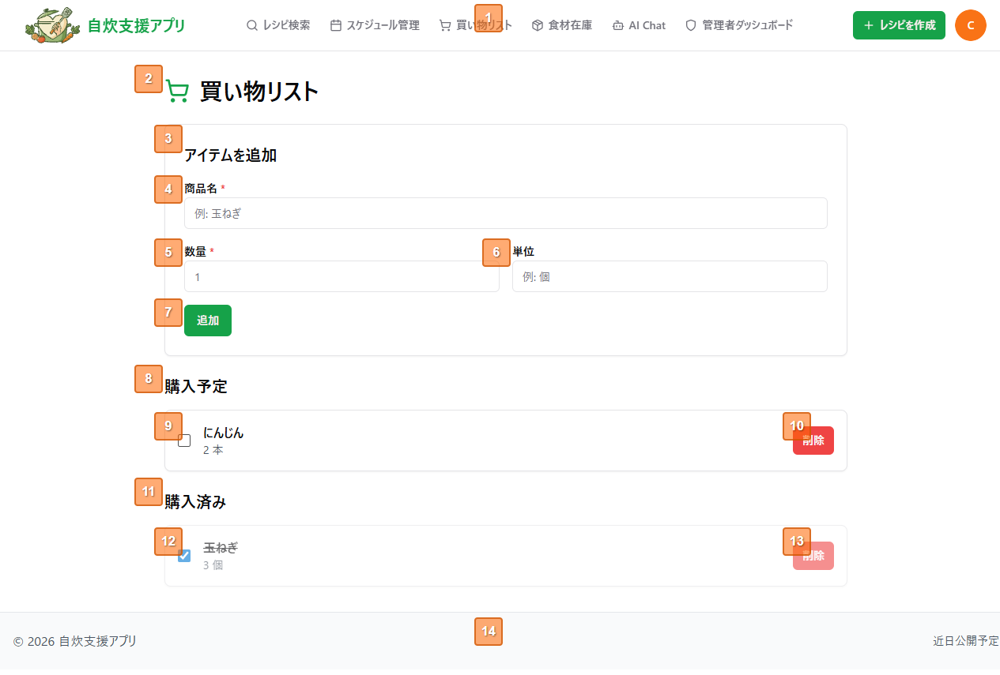

## 買い物リスト 画面設計書

### 1. 概要
- 目的：ユーザーが購入予定の食材を管理し、買い物の漏れを防ぐ
- 対象ユーザー：ログイン済みの一般ユーザー
- 前提条件：ログイン必須（未ログイン時は `/login` にリダイレクト）

### 2. 画面レイアウト

### 3. 画面項目

| 項番 | 項目名                   | 種別               | 表示/入力 | 必須  | 型/形式 |   桁 | 初期値             | 入力規則                                                                | 備考                                                                                                                                                      |
| ---: | ------------------------ | ------------------ | --------- | :---: | ------- | ---: | ------------------ | ----------------------------------------------------------------------- | --------------------------------------------------------------------------------------------------------------------------------------------------------- |
|    1 | ヘッダー                 | ナビゲーション     | 表示      |   -   | -       |    - | -                  | -                                                                       | 共通ヘッダー。ナビリンク（レシピ検索、スケジュール管理、買い物リスト、食材在庫、AI Chat、管理者ダッシュボード）、レシピ作成ボタン、ユーザーアイコンを含む |
|    2 | ページタイトル           | 見出し（h1）       | 表示      |   -   | -       |    - | 「買い物リスト」   | -                                                                       | ShoppingCartアイコン付き                                                                                                                                  |
|    3 | アイテム追加カード       | カード見出し（h2） | 表示      |   -   | -       |    - | 「アイテムを追加」 | -                                                                       | Card コンポーネント内                                                                                                                                     |
|    4 | 商品名                   | テキスト入力       | 入力      |   ○   | 文字列  |    - | 空                 | 必須（HTML required）。空の場合フォーム送信不可                         | id="name"、placeholder「例: 玉ねぎ」                                                                                                                      |
|    5 | 数量                     | 数値入力           | 入力      |   ○   | 数値    |    - | 空                 | 必須（HTML required）。min=0.01、max=9999、step=0.01。小数点以下2桁まで | id="quantity"、placeholder「1」、type="number"                                                                                                            |
|    6 | 単位                     | テキスト入力       | 入力      |   -   | 文字列  |    - | 空                 | 任意                                                                    | id="unit"、placeholder「例: 個」                                                                                                                          |
|    7 | 追加ボタン               | ボタン             | 操作      |   -   | -       |    - | 「追加」           | -                                                                       | type="submit"。API通信中は disabled になり、テキストが「読み込み中...」に変化                                                                             |
|    8 | 購入予定セクション見出し | 見出し（h2）       | 表示      |   -   | -       |    - | 「購入予定」       | -                                                                       | 未チェックアイテムが1件以上ある場合のみ表示                                                                                                               |
|    9 | 購入予定アイテム         | カード             | 表示/操作 |   -   | -       |    - | -                  | -                                                                       | チェックボックス（未チェック）、商品名、数量＋単位を表示。チェックボックスクリックで購入済みへ移動                                                        |
|   10 | 削除ボタン（購入予定）   | ボタン             | 操作      |   -   | -       |    - | 「削除」           | -                                                                       | variant="destructive"（赤色）。確認ダイアログなし、即時削除                                                                                               |
|   11 | 購入済みセクション見出し | 見出し（h2）       | 表示      |   -   | -       |    - | 「購入済み」       | -                                                                       | チェック済みアイテムが1件以上ある場合のみ表示                                                                                                             |
|   12 | 購入済みアイテム         | カード             | 表示/操作 |   -   | -       |    - | -                  | -                                                                       | チェックボックス（チェック済み）、商品名（取り消し線）、数量＋単位を表示。カード全体が半透明（opacity-60）。チェックボックスクリックで購入予定へ戻す      |
|   13 | 削除ボタン（購入済み）   | ボタン             | 操作      |   -   | -       |    - | 「削除」           | -                                                                       | variant="destructive"（赤色）。確認ダイアログなし、即時削除                                                                                               |
|   14 | フッター                 | フッター           | 表示      |   -   | -       |    - | -                  | -                                                                       | 共通フッター。「© 2026 自炊支援アプリ」「近日公開予定」リンク                                                                                             |

### 4. 操作・イベント

| 画面項番 | 操作                     | トリガー                                   | 条件                   | 処理内容                                             | 成功時                                                                                                                                       | 失敗時                                                   |
| -------- | ------------------------ | ------------------------------------------ | ---------------------- | ---------------------------------------------------- | -------------------------------------------------------------------------------------------------------------------------------------------- | -------------------------------------------------------- |
| 7        | アイテム追加             | 追加ボタン押下（フォームsubmit）           | 商品名・数量が入力済み | API呼び出し（addItem）。商品名・数量・単位を送信     | 「購入予定」セクションに新しいアイテムカードが表示される。フォームの入力欄がリセット（空）になる                                             | 画面上部にエラーメッセージが表示され、自動スクロールする |
| 9        | チェックを入れる         | 購入予定アイテムのチェックボックスクリック | -                      | API呼び出し（updateItem）。isChecked を true に更新  | 対象アイテムが「購入予定」から消え、「購入済み」に移動。半透明＋取り消し線で表示。購入予定が0件になった場合、セクション見出しごと非表示      | エラーメッセージ表示                                     |
| 10       | アイテム削除（購入予定） | 削除ボタン押下                             | -                      | API呼び出し（deleteItem）                            | 対象アイテムがリストから消える。該当セクションが0件になった場合、見出しごと非表示。全アイテム0件の場合「買い物リストは空です」メッセージ表示 | エラーメッセージ表示                                     |
| 12       | チェックを外す           | 購入済みアイテムのチェックボックスクリック | -                      | API呼び出し（updateItem）。isChecked を false に更新 | 対象アイテムが「購入済み」から消え、「購入予定」に移動。通常表示に戻る。購入済みが0件になった場合、セクション見出しごと非表示                | エラーメッセージ表示                                     |
| 13       | アイテム削除（購入済み） | 削除ボタン押下                             | -                      | API呼び出し（deleteItem）                            | 対象アイテムがリストから消える。該当セクションが0件になった場合、見出しごと非表示。全アイテム0件の場合「買い物リストは空です」メッセージ表示 | エラーメッセージ表示                                     |

### 5. 補足
- 権限/ロール：ログイン済みユーザーのみアクセス可能。未ログイン時は `/login` にリダイレクト
- 性能/制約：
  - API通信中は追加ボタンが disabled になり、テキストが「読み込み中...」に変わる
  - エラー発生時は画面上部にエラーメッセージが表示され、自動スクロールする（useScrollToMessage フック使用）
  - 同名の食材を追加した場合、既存アイテムが更新される可能性がある
- 表示条件：
  - 「購入予定」セクション：未チェックアイテムが1件以上ある場合のみ表示
  - 「購入済み」セクション：チェック済みアイテムが1件以上ある場合のみ表示
  - 「買い物リストは空です」メッセージ：全アイテムが0件かつ読み込み中でない場合に表示
- 要確認事項：なし
